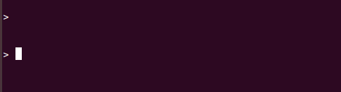

Once the program has started, you will be prompted to enter input on lines containing '>'. All the commands follow a 
basic structure with the command being the first string and can be followed by more strings which should be seperated by a space.
Type help to get the full list of commands or type "info [commandName]" to get$

Examples:

    \> test

    \> add 50 2

    \> bitcount 15

    \> info exit

If an error occurs, the mathematical functions in ARM will call one of the following error functions in C:

    1. printOverflow
    2. printUnderflow
    3. divideError
    4. exponentError
    
    
    
    Each one of these commands prints a unique error message to the user then allows the user to input command again.
Each of there method will adjust a global variable in C which will then be checked before printing the result. If
the value of isError is greater than 0, an error has occured and an error message will be printed to the user rather
than a calculated value. 

Here are some notes on what can occur when a command is entered by the user:

- If an inputed value exceeds the 32-bit integer size of a valid command, the user will be notified that the value is to large.
  The program can also determine which input is too large (except the case where both values are too large, in which case it will say 
  first value is to large).
  

- If an invalid characters are entered into a command requesting an integer value such as a character, the user will be notified
  that the operand is invalid.
  

- If any combination of just space and tab characters will allow the user to skip a line.
 .

- If too many strings are inputed or an invalid command is entered, the user is notified that there is no such command.

Notes specifically for commands:
- For the summation command, it does not matter in which order the operands are placed at. Ex. "summation 4 6" will yield same result as "summation 6 4".
 

- Info command provides information on itself as well as exit command (not spectacular but just in case you were curious).
- The info command also provides examples on how to type a command that requires one or more operands.

Miscellaneous notes:
- This program is able to differentiate between overflow and underflow for all mathematical commands.
 
